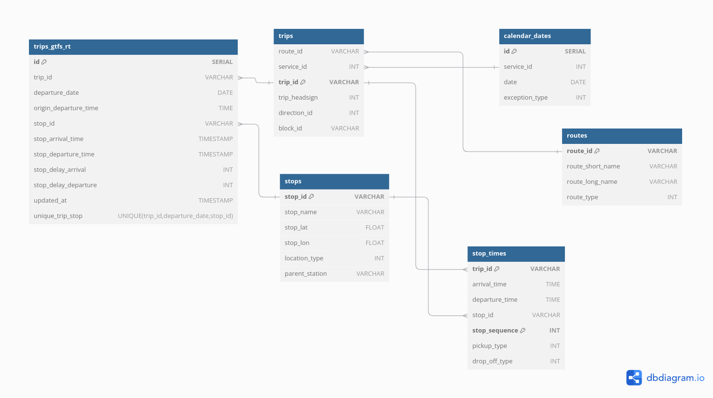

# HighSpeed Train data analysis & predictions (France | TGV)


This project covers Data engineering, Datascience & Mlops.

- Get the datas form GTFS & GTFS RT sources and store them in a Database
- use ETL pipelines to serve different purposes
- Analyse datas with a dashboard
- Train a ML model to predict delays & delay time.


## Current Features


- Get & update (every hours) GTFS Real Time datas, add these datas to a postgres Database.
- Get & update analytics files from open data, store them in a storage as csv files.


## Project Information

- **Version**: 0.0.3
- **Development Stage**: Dev
- **Author**: Guillaume Pot

[](https://www.linkedin.com/in/062guillaumepot/)


## Table of Contents
- [Introduction](#introduction)
- [What is GTFS](#what-is-gtfs)
- [Installation](#installation)
    - [Requirements](#requirements)
- [Repository](#repository)
    - [Architecture](#architecture)
    - [Branch Policy](#branch-policy)
    - [Changelogs](#changelogs)
    - [Roadmap](#roadmap)
    - [Contributions](#contirbutions)
- [Modules](#modules)
    - [Airflow](#airflow)
    - [Postgres](#postgres)
- [Miscellaneous](#miscellaneous)
    - [Data Sources](#data-sources)


## Introduction

[WIP]


## What is GTFS

``` text
The General Transit Feed Specification (GTFS) is an Open Standard used to distribute relevant information about transit systems to riders. It allows public transit agencies to publish their transit data in a format that can be consumed by a wide variety of software applications. Today, the GTFS data format is used by thousands of public transport providers.

GTFS consists of two main parts: GTFS Schedule and GTFS Realtime. GTFS Schedule contains information about routes, schedules, fares, and geographic transit details, and it is presented in simple text files. This straightforward format allows for easy creation and maintenance without relying on complex or proprietary software.

GTFS Realtime contains trip updates, vehicle positions, and service alerts. It is based on Protocol Buffers, which are a language (and platform) neutral mechanism for serializing structured data.

GTFS is supported around the world and its use, importance, and scope has been increasing. It’s likely that an agency you know already uses GTFS to represent routes, schedule, stop locations, and other information, and that riders are already consuming it via various applications.

```
<b>Source: https://gtfs.org/</b>


## Installation


### Storage


- Create a storage folder to store datas
    - Airflow volume needs these directories : raw | clean | gtfs
You should have this tree:
``` yaml
-- storage
|
├── cleaned
|   
├── gtfs
|
└── raw
```


### Database

- Create a postgres directory
- Create a directory to store Postgres datas (eg: mkdir postgres_data) 
- Copy init.sql
- Copy docker-compose.yaml
- Copy .env file & change postgres password

You should have this tree:
``` yaml
-- postgres
|
├── postgres_data        # Contains db datas
|   
├── .env                 # env variables for containers
|   
├── docker-compose.yaml  # Docker compose file
|
└── init.sql             # Used to build tables in the DataBase

```

- Start postgres services


### Airflow

- Create an airflow directory
- Create the following directories for airflow: config | dags | logs | plugins
- Make sure these directories are non root owner
- Copy docker-compose.yaml & change postgres variables (airlfow common vars)
- Copy .env file & change postgres password + sotrage dir
- Copy dag files in ./dags

You should have this tree:
``` yaml
-- airflow
|
├── config               # config
|   
├── dags                 # dags
|   
├── logs                 # logs
|   
├── plugins              # plugins
|   
├── .env                 # env variables for containers
|
└── docker-compose.yaml  # Docker compose file

```

- Start airflow services:
    - Run airflow-init to initialize airflow database (docker-compose -f docker-compose.yaml up airflow-init)
    - Run airflow services


### Requirements

- Docker
-


## Repository
### Architecture


``` yaml
|
├── .github                                       # .github directory containing workflows
|      |
|      └── workflows
|              |
|              ├── requirements_unit_tests.txt    # Unit tests workflow requirements
|              |
|              └── start_unit_test.yaml           # Workflow to start Unit Tests
|
├── build              # Build versions | Used to compile files
|
├── changelogs         # Changelogs files which contains changes for each new version 
|
├── media              # General directory, contains images & schemas for the repository
|
├── notebooks          # Scrap notebooks used to test functions, data exploration. Draft code only.
|
├── src                # Contains 'modules' used to run the app
|    |
|    ├── airflow                                                     # Airflow files
|    |      |
|    |      ├── config                                               # Config files
|    |      |
|    |      ├── dags                                                 # Dags directory
|    |      |    |
|    |      |    ├── common_functions.py                             # Functions for DAG
|    |      |    |
|    |      |    ├── ETL_files_froms_open_data_sources_functions.py  # Functions for DAG
|    |      |    |  
|    |      |    ├── ETL_files_froms_open_data_sources.py            # DAG
|    |      |    |
|    |      |    ├── gtfs_data_ingestion_functions.py                # Functions for DAG
|    |      |    |
|    |      |    ├── gtfs_data_ingestion.py                          # DAG
|    |      |    |
|    |      |    ├── gtfs_queries.py                                 # Queries dictionary used to ingest data in PGDB
|    |      |    |
|    |      |    ├── gtfs_rt_data_ingestion_functions.py             # Functions for DAG
|    |      |    |
|    |      |    ├── gtfs_rt_data_ingestion.py                       # DAG
|    |      |    |
|    |      |    ├── remove_xcoms.py                                 # DAG
|    |      |    |
|    |      |    └── sources.json                                    # Source URL for files | Data
|    |      |
|    |      ├── logs                                      # Logs
|    |      |
|    |      └── plugins                                   # Plugins
|    |
|    ├── postgres                       # Postgres db files
|    |      |
|    |      ├── docker-compose.yaml     # Compose file to start postgres container
|    |      |
|    |      └── init.sql                # Table declaration for postgres container
|    |
|    └── unit_tests                     # Unit tests files
|
├── .gitignore
|
├── LICENSE
|
└── README.md

```


### Branch Policy

``` yaml

├── main    # Main branch, contains releases
|   
├── build   # Used to build releases  (eg: build-0.0.3)
|
├── debug   # Debug branch  (eg: debug-0.0.4)
|
└── develop # New features development branch (eg: dev-0.0.4)

```


### Changelogs

[v0.0.3](./changelogs/0.0.3.md)
[v0.0.2](./changelogs/0.0.2.md)
[v0.0.1](./changelogs/0.0.1.md)


### Roadmap

```
0.1.0
- Get next trains from a station script
- Display a train informations script + Train itinary map | Station & train routes graph

0.2.0
- Station & lines graph (Neo4J DB)

0.3.0
- BI board -> data analysis

1.1.0
- Train delay prediction (classification)
- Train time delay prediction (regression)
```


### Contributions

```
-
```


## Modules

### Airflow

The schemas below display dags Airflow executes to fetch datas.


<b> GTFS RT Ingestion Dag </b>
- Schedule: Every hour from 05:00am to 11:30pm, every day


<b> GTFS Ingestion Dag </b>
- Schedule: Once a day, at 10:00pm


<b> DAG ETL - Get open data files from source</b>
- Schedule: First day of each month


<b> Xcom Remover </b>
- Xcom remover dag is used to clean all Xcoms, it is triggered every day at 03:00am


### PostGres

The schema below shows tables and relations for the database.
Ingested datas are GTFS & GFTS RT.

GTFS RT datas are updated every 5 minutes.
GTFS datas are updated once a day.




## Miscellaneous

### Data sources

GTFS & GTFS RT
https://ressources.data.sncf.com/explore/dataset/horaires-des-train-voyages-tgvinouiouigo/information/

Train stations:
https://ressources.data.sncf.com/explore/dataset/gares-de-voyageurs/information/?disjunctive.segment_drg

Station occupation:
https://ressources.data.sncf.com/explore/dataset/frequentation-gares/information/?disjunctive.nom_gare&disjunctive.code_postal&sort=nom_gare

TGV global ponctuality:
https://ressources.data.sncf.com/explore/dataset/reglarite-mensuelle-tgv-nationale/information/

TGV by route ponctuality:
https://ressources.data.sncf.com/explore/dataset/regularite-mensuelle-tgv-aqst/information/

Traffic informations:
https://www.sncf-voyageurs.com/fr/voyagez-avec-nous/horaires-et-itineraires/